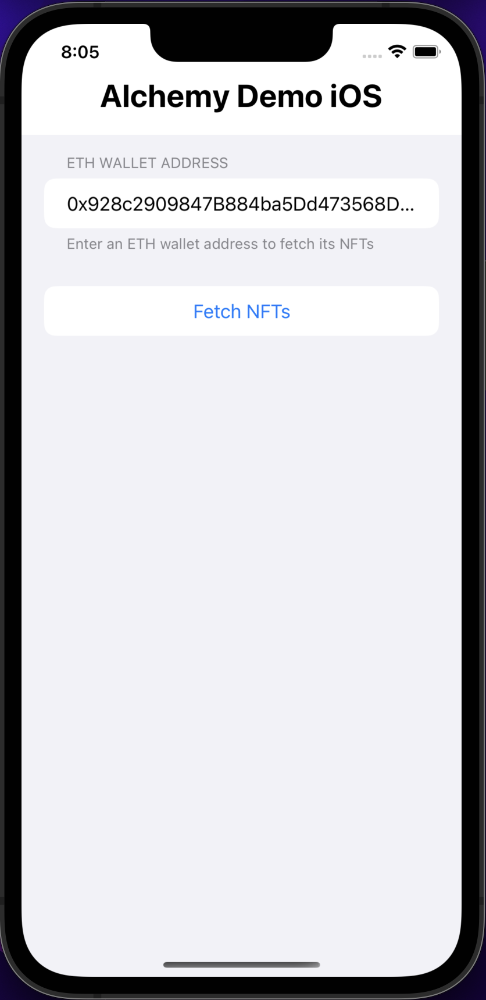
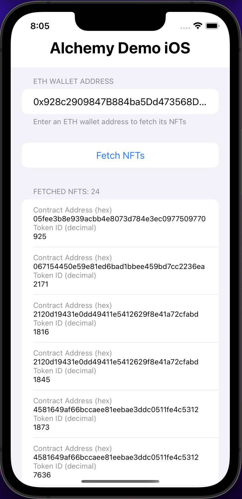
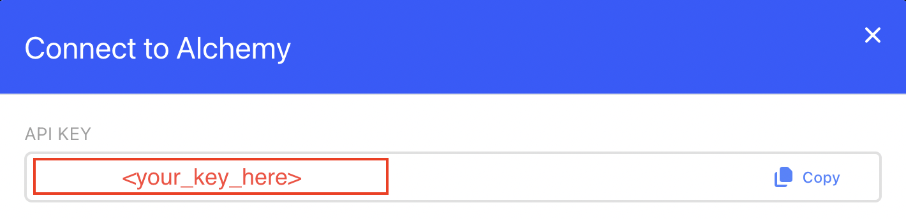
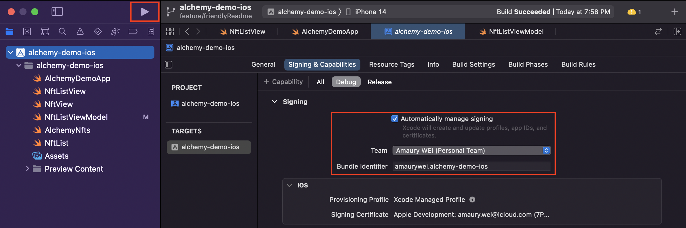

<h1>alchemy-demo-ios</h1>

A small iOS 15.0 application demonstrating some capabilities of the 
[Alchemy](https://www.alchemy.com/) API.

- [👀 - Overview](#---overview)
  - [🚀 - Live Demonstration](#---live-demonstration)
  - [📸 - Screenshots](#---screenshots)
- [🔐 - Getting your Alchemy API key](#---getting-your-alchemy-api-key)
- [🛠 - Building the application](#---building-the-application)
  - [📑 - Requirements](#---requirements)
  - [📱 - Building steps](#---building-steps)

## 👀 - Overview

This application allows you to: 
- Get the list of the NFTs owned by an ETH wallet address (using 
[`/getNfts`](https://docs.alchemy.com/reference/getnfts) from 
[Alchemy](https://www.alchemy.com/))
- Open the URL associated to the NFT by clicking on the list item

### 🚀 - Live Demonstration

### 📸 - Screenshots

    
    

## 🔐 - Getting your Alchemy API key

1. Create an [Alchemy](https://www.alchemy.com/) account at the official website

2. Create an Alchemy application on the Ethereum mainnet and open its key

3. Copy the application's API key 

## 🛠 - Building the application

### 📑 - Requirements

|       | Minimum | Tested |
| ----- | ------- | ------ |
| Xcode | 13.0    | 14.2   |
| iOS   | 15.0    | 16.2   |

### 📱 - Building steps

1. Open the project in Xcode

2. Inside `NftListViewModel.swift`, replace the `ALCHEMY_API_KEY` variable with
your own [Alchemy API key](#🔐---getting-your-alchemy-api-key).

4. In the project settings, open the "Signing & Capabilities" tab for the 
`alchemy-demo-ios` target. Change the "Team" to your own team

4. In the menu bar, open the "Product" menu and click on "Build"

5. To launch the application, press on the ▶️ button in the top bar
